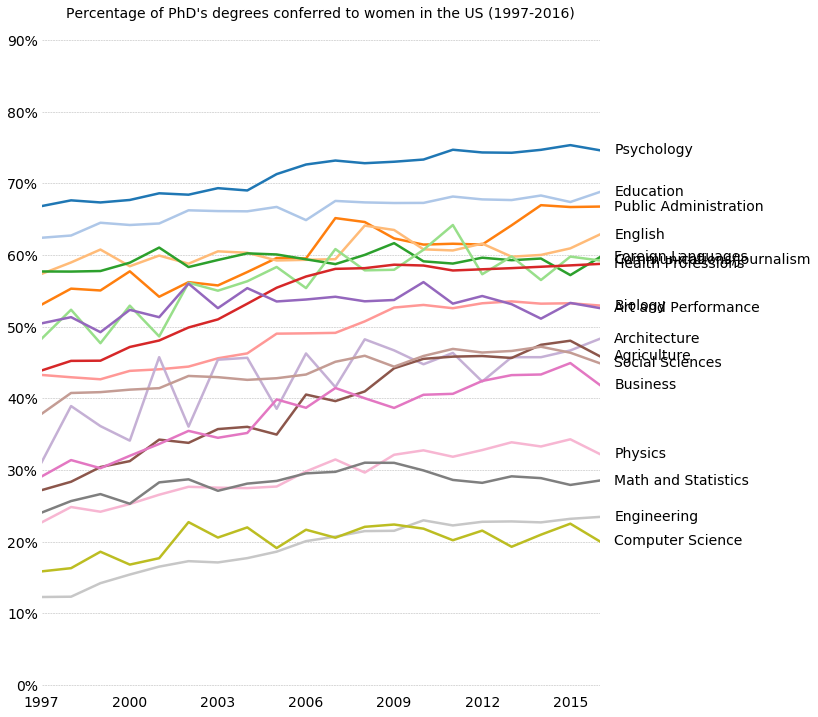
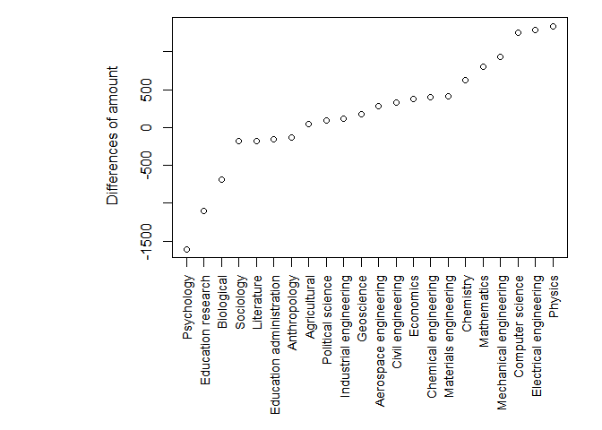
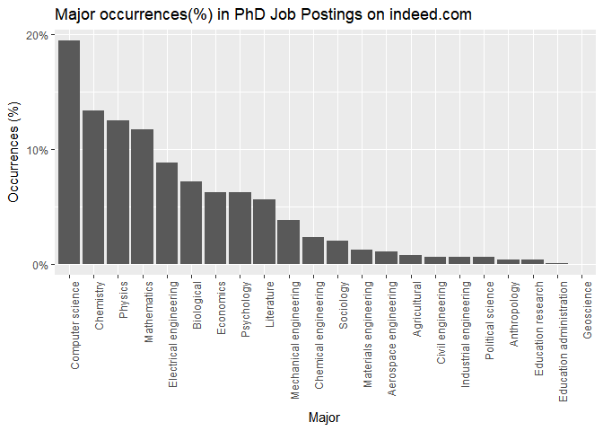
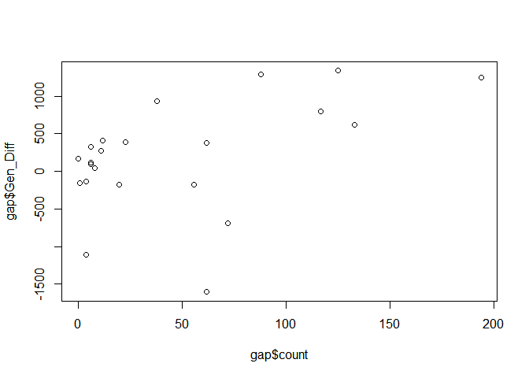
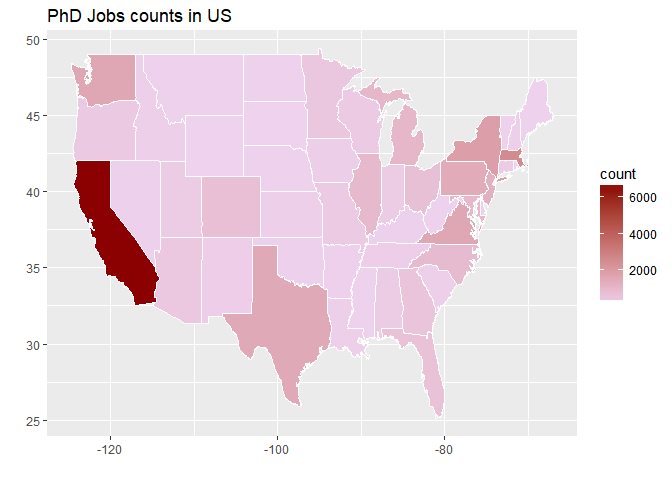
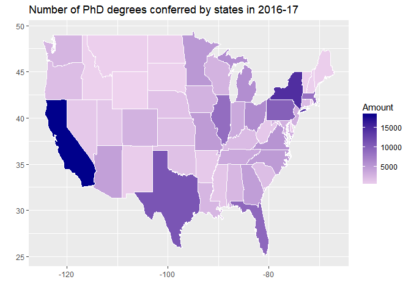
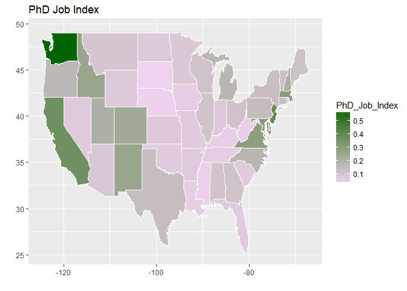

Job Market Analysis for PhD Graduates
================
Xu Dong, University of Miami
February 21, 2018

The following report of the program includes two analytical insights, *i.e.*,

-   Does my major matter? Quantifying Gender Gaps in post-PhD job opportunities
-   Does my school location matter? Quantifying Location Privilege for post-PhD career

1. Does my major matter? Quantifying Gender Gaps in Post-PhD Job Opportunities
------------------------------------------------------------------------------

Figure 1.1 Trend of PhD's degrees conferred to women by programs in the US (1997-2016)
--------------------------------------------------------------------------------------

In Figure 1.1, a trend transition point is identified: from 1997 to 2007, the percentage of PhD degrees conferred to women increased across all majors; after 2007, these rates kept steady for 10 years.

Figure 1.2 The difference amount of PhD's degrees conferred to men against women (By Major)
-------------------------------------------------------------------------------------------

22 representative majors were presented in Figure 1.2. The gender disparty in PhD majors were identified: women tended to earn PhD degrees in majors such as Psychology, Education, and Biological sciences, while men were likely to earn PhD degrees in majors such as Computer science, Electrical/Electronic Engineering, and Physics.

    ## ERROR : Failed to parse text

In order to address the concern about the gender disparty in post-PhD job opportunities, I conducted an analysis on the recent jobs opportunities posted online that required/preferred a PhD degree. I web-scrapped and analyzed 27,000+ jobs postings on indeed.com.

Figure 1.3 Major occurrences(%) in PhD Job Postings on indeed.com
=================================================================

Not suprisingly, Computer and information sciences are among the most demanding majors. Employered also had demands for PhDs in Majors such as Chemistry, Physics, and Maths, due to the high-level knowledge specilizations and requirements, which differentiate the job market for PhDs than for others.

Figure 1.4 Gender Gaps of Job Opportunities Induced by PhD programs
-------------------------------------------------------------------

Each data point represents a PhD major analyzed previously. More job opportunities are associated with majors in which men have advantages in the graduation amount. It shows the gender gaps of job opportunities induced by PhD programs.

2. Does my school location matter? Quantifying Location Privilege for Post-PhD Career
-------------------------------------------------------------------------------------

Under an assumption that employers prefer to recruit talents in local areas, this analysis tends to find whether the program location will give PhD graduates a privilege for finding a PhD-level job.

Figure 2.1 Job for PhDs (Data scrapped from indeed.com)
-------------------------------------------------------

Figure 2.2 PhD degree conferred by states (Data from www.nsf.gov/statistics/)
-----------------------------------------------------------------------------

Figure 2.3 PhD Job Index by states
----------------------------------

By simply dividing the job posting amount by for each state in the US, I proposed a measure, called *Location Privilege Index (LPI)*, to quantify the job finding privilege induced by location for post-PhD career.

