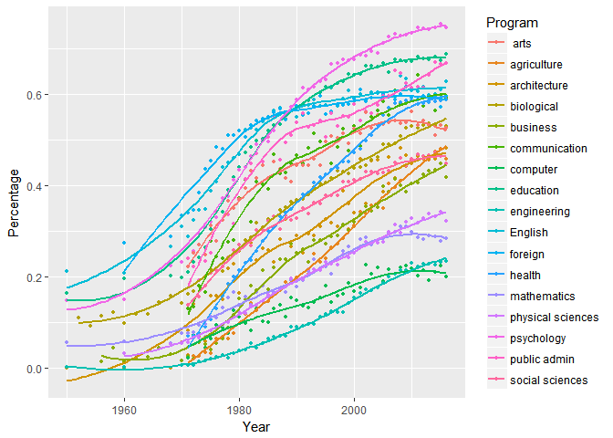

Job Market Analysis for PhD Graduates
================
Xu Dong, University of Miami
July 23, 2018

The following report includes three analytical insights from investigating the job market for PhD graduates in the US, *i.e.*,

-   Does gender matter?
-   Does my major matter?
-   Does my school location matter?

1. Does gender matter?
======================

To answer this question, I scrapped the data ssing R package "rvest" from multiple tables on the National Center for Education Statistics website (<https://nces.ed.gov/programs/digest/>).

##### Figure 1. Percentage of PhD's degrees conferred to women in the US (1950-2017)

##### Figure 2. The difference amount of PhD's degrees conferred to men against women (Year 2017)

    ## ERROR : Failed to parse text

2. Does my major matter?
========================

In order to address the concern about the gender disparty in post-PhD job opportunities, I conducted an analysis on the recent jobs opportunities posted online that required/preferred a PhD degree. I scrapped and analyzed 27,000+ jobs postings on indeed.com (<https://indeed.com/jobs?q=PhD>). Note here that the jobs posts in indeed.com have dupulicates.I used text mining techniques to compare the similarity of the bag of words between any given pair of job posts. If their similarity are over 95%, I took them as the same post.

#### Figure 3. Major occurrences(%) in PhD Job Postings on indeed.com

#### Figure 4. Gender Gaps of Job Opportunities Induced by PhD programs

3. Does my school location matter?
==================================

Assuming that employers prefer to recruit talents in local areas, this analysis tends to find whether the program location will give PhD graduates a privilege for finding a job. Data are scrapped from National Science Fundation website (www.nsf.gov/statistics/) and indeed.com (<https://indeed.com/jobs?q=PhD>) on Feb 20th, 2018.

#### Figure 5. Number of Job for PhDs by states (Data scrapped from indeed.com)

#### Figure 6. Number of PhD degree conferred by states

#### Figure 7. PhD Job Index by states

By simply dividing the job posting amount by the number of PhD degree conferred for each state in the US, I proposed a measure, called *Location Privilege Index (LPI)*, to quantify the job finding privilege induced by location for post-PhD career.

