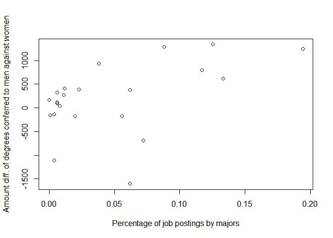
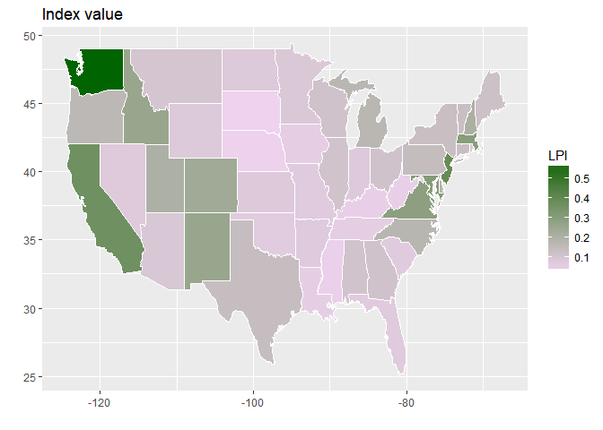

Job Market Analysis for PhD Graduates
================
Xu Dong
February 21, 2018

Gender Gaps in PhD Graduates
----------------------------

PhD jobs by majors
------------------

PhD jobs posted on indeed.com
-----------------------------

    ## ERROR : Failed to parse text

Plot 1
------

Plot 2
------

Job locations for PhDs
----------------------

PhD degree conferred by states
------------------------------

PhD Job Index by states
-----------------------

